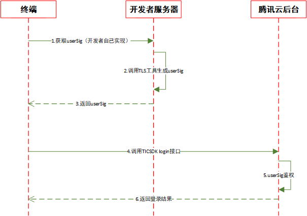

# 腾讯互动课堂SDK（TICSDK）集成使用文档
## 1. 简介
腾讯互动课堂（Tencent Interact Class，TIC）SDK 是一个提供在线教育场景下综合解决方案，它对`WebRTCAPI`、`boardSDK`、`ImSDK`和`COSSDK`等SDK进行了业务封装，提供了【多人音视频】，【多人即时通信】，【多人互动画板】【文档云端转码预览】等功能。适用于在线互动课堂，在线会议，你画我猜等场景。

## 2.准备工作
TICSDK使用了实时音视频服务（WebRTCAPI）、云通讯服务（IMSDK）、COS服务等腾讯云服务能力，在使用腾讯互动课堂服务时，请花点时间了解以上服务的基本概念和基本业务流程。

[实时音视频](https://cloud.tencent.com/document/product/647) 提供了实时音视频通话的能力

[云通讯服务（IMSDK）](https://cloud.tencent.com/document/product/269/1504) 提供单聊、群聊能力

[COS服务](https://cloud.tencent.com/document/product/436/6225) 提供云端存储以及文档在线预览服务


## 3.集成SDK

```
<!-- WebRTC SDK -->
<script src="https://sqimg.qq.com/expert_qq/webrtc/2.4/WebRTCAPI.min.js"></script>
<!-- WebIM SDK -->
<script src="https://sqimg.qq.com/expert_qq/webim/1.7.1/webim.min.js"></script>
<!-- 白板SDK -->
<script src="http://sqimg.qq.com/expert_qq/edu/2.0.0/board_sdk.mini.js"></script>
<!-- COS SDK -->
<script src="https://sqimg.qq.com/expert_qq/cos/5.0.0/cos.mini.js"></script>
<!-- TIC SDK -->
<script src="https://sqimg.qq.com/expert_qq/TICSDK/1.0.0/TICSDK.mini.js"></script>
```


## 4. 使用SDK

### 4.1 SDK简介

> TICSDK是以事件驱动模式的SDK；接入方只需要简单的调用简单几个方法，注册与业务相关事件监听，即可完成简单的接入。[TICSDK事件](./API/TICSDK事件总览.md)

SDK | 主要功能
--------- | ---------
TICSDK | 整个SDK的入口类，提供了SDK【初始化】、【登录/登出SDK】、【创建/加入/销毁课堂】、【音视频操作】、【IM操作】以及【获取IMSDK实例、WebRTCAPI实例、白板实例】的接口。[TICSDKAPI文档](./API/TICSDKAPI.md)
BoardSDK | 白板提供了画曲线，直线，矩形，圆形，激光笔，橡皮擦，上传PPT，PDF, 等功能。白板接口请参考[白板API文档](./API/白板SDKAPI.md)
IMSDK | TICSDK中提供了普通文本单聊、群聊，自定义消息单聊、群聊四个基础接口，如果不满足业务需求，可获取IM实例后，按腾讯云提供的[IM文档](https://cloud.tencent.com/document/product/269/1594)实现业务需求。
WebRTCAPI | TICSDK中提供了常见的音视频通话接口，如果不满足业务需求，可获取WebRTCAPI实例后，按腾讯云提供的[WebRTCAPI](https://cloud.tencent.com/document/product/647/16924)实现业务需求。

### 4.2 白板和视频的渲染

> TICSDK中需要将白板和视频渲染至页面中，白板渲染需要在进入课堂的时候将承载白板渲染的dom节点id传入，而视频的渲染则是通过事件回调的方式，将音视频的流输出到页面video/audio标签中。

> 白板仅支持款宽高比为<font color="red"> 16：9 </font>的比例显示。请开发者注意与设计师同步该信息，以及不要随意修改该比例，以免影响白板功能的正常体验。

### 4.3 业务流程

TICSDK使用的一般流程如下：


其中<font color="red"> 创建课堂 </font>为教师角色特有流程，学生角色不需调用。


> 下面将SDK按照功能划分，遵循一般的使用顺序，介绍一下TICSDK中各功能的使用方法和注意点:


### 4.4 初始化SDK

要使用TICSDK，首先得进行初始化。

```
// TICSDK.js
this.ticSdk = new TICSDK();
this.ticSdk.init();
```

### 4.5 监听事件

当初始化完成后，则需要进行事件监听，TICSDK是以事件驱动模式的SDK，需要监听关键的事件来实现相关的业务。

事件监听的方法：

```
ticsdk.on('事件名'，回调函数);
```

比如：
```
var ticsdk = new TICSDK();
  ticSdk.on(TICSDK.CONSTANT.EVENT.IM.LOGIN_SUCC, res => {
});
```

### 4.6 登录

初始化完成之后，因为涉及到IM消息的收发，所以还必须先登录，调用登录方法后，则会触发登录成功[TICSDK.CONSTANT.EVENT.IM.LOGIN_SUCC]或者登录失败[TICSDK.CONSTANT.EVENT.IM.LOGIN_ERROR]的事件：

```
this.ticSdk.login(loginConfig);
```

loginConfi：

参数名 | 是否必填 | 备注 |
--------- | --------- | -----
identifier | 是 | 用户名
userSig | 是 | 登录鉴权信息
sdkAppId | 是 | 腾讯云应用的唯一标识，可以登录[实时音视频控制台](https://console.qcloud.com/rav)查看
accountType | 是 | 腾讯云应用的账号类型，可以登录[实时音视频控制台](https://console.qcloud.com/rav)，选择指定的应用后，在功能配置页面中查看

该方法传入参数，identifier和userSig，identifier为用户ID，userSig为腾讯云后台用来鉴权的用户签名，相当于登录TICSDK的用户密码，需要开发者服务器遵守腾讯云生成userSig的规则来生成，并下发给WEB端。登录的流程如下：



> 在开发调试阶段，用户可以在自己的腾讯云应用控制台使用开发辅助工具，来生成临时的uid和userSig用于开发测试。详情请参考：[生成签名](https://cloud.tencent.com/document/product/647/17275)

> 如果此用户在其他终端被踢，登录将会失败，则会触发被踢下线的事件[TICSDK.CONSTANT.EVENT.IM.KICKED]，开发者必须进行登录错误事件码 TICSDK.CONSTANT.EVENT.IM.KICKED 的判断。

### 4.7 登出

调用登出方法后，会触发登出成功[TICSDK.CONSTANT.EVENT.IM.LOGOUT_SUCC]或者登出失败[TICSDK.CONSTANT.EVENT.IM.LOGOUT_ERROR]的事件：

```
this.ticSdk.logout();
```

### 4.8 课堂管理

登录成功之后，就可以创建或者加入课堂了。

- #### 4.8.1 创建课堂

调用此方法后则会触发创建课堂成功或者创建课堂失败的事件。

```
this.ticSdk.createClassroom({
  roomID: 房间号
});
```
roomID参数：

参数名 | 类型 | 是否必填 | 备注
--------- | --------- | -----| ---
roomID | integer | 是 | 由业务方下发，并保证每次下发的roomID是唯一不重复的。

- #### 4.8.2 加入课堂

加入课堂可以通过配置webrtc相关的参数，来控制是否自动/手动推流，以及是否启用摄像头和麦克风等，也可以配置白板的渲染节点，以及白板初始化颜色，以及是否可以在白板涂鸦等，而COS的配置决定了白板是否可以具备上传ppt,pdf,doc等文档能力。调用此方法后则会触发加入课堂成功或者加入课堂失败的事件。

```
this.ticSdk.joinClassroom(roomID, webrtc推流配置, 白板配置, COS配置);
```

roomID同上

webrtc推流配置参数：

参数	| 类型	| 是否必填 | 描述
--------- | --------- | ----- | --------- |
closeLocalMedia | boolean | 否，默认 false | 是否关闭自动推流（如果置为 true，则在完成加入/建房操作后，不会发起本端的推流，如需推流，需要由业务主动调推流接口 ）
audio | boolean | 否，默认 true | 是否启用音频采集
video | boolean | 否，默认 true | 是否启用视频采集
role | string | 否，默认 user | 角色名，每个角色名对应一组音视频采集的配置，可在[控制台 - 画面设定](https://console.qcloud.com/rav)中配置

白板配置参数：

参数	| 类型	| 是否必填 | 描述
--------- | --------- | ----- | --------- |
id | string | 是 | 白板渲染的在dom节点id，并保证该节点有position: relative样式，否则可能会引起白板定位异常的问题。
canDraw | boolean | 否，默认 false | 默认白板是不能进行涂鸦，如果需要进行涂鸦请设置为true
color | string | 否，默认红色 |画笔颜色，只接受hex色值，如#ff00ff，大小写不敏感
globalBackgroundColor | string | 否，默认白色 | 全局的白板背景色


COS配置(可选配置)，如果没有上传功能，则不需要配置COS

参数	| 类型	| 是否必填 | 描述
--------- | --------- | ----- | --------- |
appid | string | 是 | APPID 是腾讯云账户的账户标识之一。在[腾讯云账号中心](https://console.cloud.tencent.com/developer)中可以看到。
bucket | string | 是 | 在 COS 中用于存储对象。一个存储桶中可以存储多个对象。在[COS控制台](https://console.cloud.tencent.com/cos5/bucket)中可以看到
region | string | 是 | 地域即 Region，表示 COS 的数据中心所在的地域。在[COS控制台](https://console.cloud.tencent.com/cos5/bucket)中可以看到
sign | string | 是 | COS鉴权sign，需要业务方自行下发。

- #### 4.8.3 退出课堂

调用退出课堂，只是调用者自己退出课堂。调用此方法后，则会触发退出课堂成功或者退出课堂失败的事件。

```
this.ticSdk.quitClassroom();
```

- #### 4.8.4 销毁课堂

调用销毁课堂，则会真正将课堂销毁，本方法只能由课堂的创建者调用，非创建则调用则不能销毁课堂，并触发销毁课堂失败的事件。调用此方法后，则会触发退出课堂成功或者退出课堂失败的事件。
```
this.ticSdk.destroyClassRoom()
```

### 4.9 白板相关操作

白板的相关操作直接通过TICSDK提供的获取白板实例接口获取白板实例来操作白板，TICSDK不做任何封装。详见[WEB白板API](./API/白板SDKAPI.md)。

### 4.10 IM相关操作

IM相关的接口封装于腾讯云通信IMSDK，TICSDK中封装4个常用接口，通过监听消息事件的回调来处理消息。

- #### 4.10.1 普通文本单聊

  单聊会接收到TICSDK.CONSTANT.EVENT.IM.RECEIVE_C2C_MSG事件

```
this.ticSdk.sendC2CTextMessage(receiveUserIdentifier, msgText)
```

参数	| 类型	| 是否必填 | 描述
--------- | --------- | ----- | --------- |
receiveUserIdentifier | string | 是 | 接收方的identifier
msgText | string | 是 | 要发送的文本内容

- #### 4.10.2 普通文本群聊

  群聊会接收到TICSDK.CONSTANT.EVENT.IM.RECEIVE_CHAT_ROOM_MSG事件

```
this.ticSdk.sendGroupTextMessage(msgText)
```
参数	| 类型	| 是否必填 | 描述
--------- | --------- | ----- | --------- |
msgText | string | 是 | 要发送的文本内容

- #### 4.10.3 自定义消息单聊

  单聊会接收到TICSDK.CONSTANT.EVENT.IM.RECEIVE_C2C_MSG事件

```
this.ticSdk.sendC2CCustomMessage(receiveUserIdentifier, msgObj)
```

参数	| 类型	| 是否必填 | 描述
--------- | --------- | ----- | --------- |
receiveUserIdentifier | string | 是 | 接收方的identifier
msgObj | Object | 是 | 自定义文本消息对象 msgObj = {data: '发送的内容', desc: '描述', ext: '扩展'}

- #### 4.10.4 自定义消息群聊

  群聊会接收到TICSDK.CONSTANT.EVENT.IM.RECEIVE_CHAT_ROOM_MSG事件

```
this.ticSdk.sendGroupCustomMessage(msgObject)
```

参数	| 类型	| 是否必填 | 描述
--------- | --------- | ----- | --------- |
msgObj | Object | 是 | 自定义文本消息对象 msgObj = {data: '发送的内容', desc: '描述', ext: '扩展'}

### 4.11 音视频相关操作

WebRTC会默认选中一个摄像头和麦克风作为输入设备，如果需要切换摄像头和麦克风则可以参考以下接口：

- #### 4.11.1 获取摄像头设备

```
this.ticsdk.getCameraDevices(callback)
```
参数	| 类型	| 是否必填 | 描述
--------- | --------- | ----- | --------- |
callback | function | 是 | 回调函数的参数值返回了当前PC上可用的摄像头

- #### 4.11.2 切换摄像头

```
this.ticSdk.switchCamera(device);
```
| 参数 | 类型 | 描述 |
| --- | --- | --- |
| device | Object | 摄像头设备 |

- #### 4.11.3 获取麦克风

```
this.ticsdk.getMicDevices(callback)
```
参数	| 类型	| 是否必填 | 描述
--------- | --------- | ----- | --------- |
callback | function | 是 | 回调函数的参数值返回了当前PC上可用的麦克风

- #### 4.11.4 切换麦克风

```
this.ticSdk.switchMic(device);
```
| 参数 | 类型 | 描述 |
| --- | --- | --- |
| device | Object | 麦克风设备 |

- #### 4.11.5 启用/关闭摄像头

```
this.ticksdk.enableCamera();
```
| 参数 | 类型 | 描述 |
| --- | --- | --- |
| true | Boolean | 开启摄像头； false 关闭摄像头 |

- #### 4.11.6 启用/关闭麦克风

```
this.ticksdk.enableMic();
```

| 参数 | 类型 | 描述 |
| --- | --- | --- |
| true | Boolean | 开启麦克风； false 关闭麦克风 |

- #### 4.11.7 手动推流

如果在进房的时候设置了closeLocalMedia为true，则需要调用startRTC进行手动推流
```
this.ticSdk.startRTC();
```


## 4.12 文档的上传

TICSDK支持图片，ppt,pdf,doc文档上传，以及提供预览服务。

```
this.ticSdk.uploadFile(file, succ, fail)
```
| 参数 | 类型 | 描述 |
| --- | --- | --- |
| file | File | 文件对象，通常这样获取document.getElementById('file_input').files[0] |
| succ | function | 成功回调 如果文件类型是图片，回调函数参数第一个值是文件名，第二个参数为图片的url; 如果上传文件类型为doc，docx, excel, ppt, pdf， 回调函数第一个参数为该文档的总页数，第二个参数为文件信息，包含[文件名，文件下载地址，文件每一页预览的图片地址] |
| fail | function | 失败回调 |

> 如果是上传文档会触发上传进度TICSDK.CONSTANT.EVENT.COS.PROGRESS事件

## 4.13 获取白板，IM，WebRTC的实例

 - #### 4.13.1 获取白板实例

 > 获取白板实例， 白板实例需要在监听到进房成功事件[TICSDK.CONSTANT.EVENT.TIC.JOIN_CLASS_ROOM_SUCC]()后才返回

 ```
 this.ticsdK.getSketchInstance()
 ```

- #### 4.13.2 获取IM实例

> 初始化TICKSDK后即可获得IM实例

 ```
 this.ticsdK.getImInstance()
 ```

- #### 4.13.3 获取WebRTC实例

> 获取WebRTC实例， WebRTC实例需要在监听到进房成功事件[TICSDK.CONSTANT.EVENT.TIC.JOIN_CLASS_ROOM_SUCC]()后才返回

 ```
 this.ticsdK.getWebRTCInstance()
 ```

## 5.常见问题

1. 音视频回声的问题？
> 页面上的video/audio是否设置muted = true

2. 监听了事件，但没有不回调？
> 监听事件是否在调用登录接口前就完成了监听


